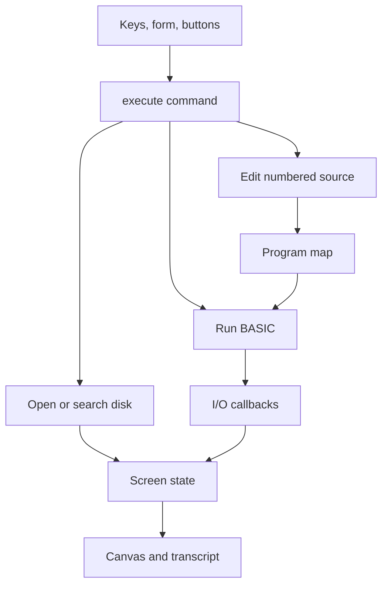

# How Public Space works

This document describes the current implementation. Proposed extensions in the tutorial are not existing features.

## Boundaries

| Layer | File | Responsibility |
| --- | --- | --- |
| Document | `dist/index.html` | Canvas, real command input, controls, readable transcript |
| Layout | `dist/screen.css` | Local font, responsive layout, full-screen sizing |
| Computer interface | `dist/computer.js` | Cell buffer, drawing, commands, modes, content loading, persistence |
| Language | `dist/basic.js` | Line editing, expression parsing, statements, execution state |
| Content catalog | `dist/disk.json` | Explicit list of published text, programs, and links |
| Content | `dist/pages/`, `dist/programs/` | Plain text and BASIC source |
| Build helper | `build.mjs` | Validate manifest and regenerate ASCII/CRLF feed |
| Verification | `tests/basic.test.mjs` | Interpreter behavior tests using injected I/O |
| Publication | `.github/workflows/pages.yml` | Check and publish `dist/` through GitHub Pages |

Unlike many web projects, most of `dist/` is authored source. Only `dist/feed/` is generated. There is no frontend compilation pipeline and no npm runtime dependency.

## Boot sequence

1. The browser loads HTML, CSS, and `computer.js` as an ES module.
2. The module imports `Basic` and creates the screen state and I/O adapter.
3. Event handlers connect keys, input, buttons, and canvas clicks to commands.
4. The module waits for the font, fetches `disk.json`, and fetches referenced content.
5. It attempts to restore the browser-local program workspace.
6. It marks the computer loaded and draws the boot/menu screen.

If content loading fails, the display shows an error and asks for a reload. The initial release fetches all disk content at startup; a much larger collection would benefit from lazy loading and a separately generated search index.

## Screen model

`rows` contains 25 arrays of 40 cell objects. Cells store `c`, `color`, and `reverse`. The renderer paints the border and 320×200 screen within a 384×272 canvas. Each cell occupies an 8×8 logical area. CSS scales the resulting image.

Text is normalized to uppercase for display, with several punctuation substitutions. This is not complete PETSCII processing. The interpreter's string values do not themselves become uppercase merely because the screen displays uppercase.

`print` updates cells and scrolls. `lineAt` writes fixed-position lines for menus and pages. The command cursor is drawn over the cell buffer. A half-second timer toggles its visible state. The readable transcript is generated from the stored rows rather than OCR or a canvas screenshot.

## Command flow and state

The UI has `menu`, `page`, `command`, and `input` modes. The interpreter additionally tracks whether it is running. These are related but distinct states: INPUT is both a running interpreter and an input-mode UI.

`execute` first handles a pending INPUT answer. Next it handles a running program, numbered lines, navigation commands, file loads, and workspace commands. Immediate PRINT/assignment/POKE are passed to `Basic.run(text)`; normal RUN calls `Basic.run()`.

`openFile` prefers the published disk, then named browser saves. PRG entries replace the workspace with source; they do not auto-run. Text pages wrap to 38 columns and paginate in groups of 19 lines. External links open through visitor actions. Menu pages contain up to 11 entries.

## Interpreter internals

The `Basic` instance owns:

- `lines`: numbered source statements in a Map.
- `vars`: values indexed by uppercase variable name.
- `memory`: a 65,536-byte Uint8Array.
- `running` and `cancelled`: execution lifecycle flags.
- `pending`: PRINT output awaiting a terminating newline.
- `io`: callbacks supplied by the host interface.

The parser tokenizes expressions and evaluates them using precedence climbing. It is not JavaScript evaluation and cannot call arbitrary JavaScript functions. The recognized functions are explicitly listed in `expression`.

RUN prepares a sorted statement list and a line-number lookup, then steps through it using `pc`. GOTO changes `pc`; GOSUB/RETURN use a return stack; FOR/NEXT use loop frames. IF and REM require special treatment during colon splitting. An instruction budget and periodic timer yields limit runaway programs and allow interruption.

The I/O boundary is what makes the language testable without a browser. Tests inject `print` to collect strings and `input` to supply answers. The actual website injects callbacks that draw, wait for user input, and implement selected POKE effects.

INPUT suspends execution on a Promise. The next submission resolves it. Stop cancels execution and resolves pending input so the loop can exit. Errors are surfaced with a line number when applicable; a finally block clears `running`.

See [BASIC.md](BASIC.md) for the precise supported subset. Do not assume original Commodore programs will work unchanged.

## Persistence and publication are separate

| Data | Location | Lifetime |
| --- | --- | --- |
| Published pages | Repository and static host | Until changed and redeployed |
| Current workspace | `public-space.workspace` in localStorage | Browser/origin-specific |
| Named saves | `public-space.programs` in localStorage | Browser/origin-specific |
| Running variables | Browser memory | Reset by numbered RUN or page reload |
| Exported program | Downloaded `.bas` text file | User-managed |

Local SAVE never writes to GitHub. Clearing browser data can remove local programs. Private browsing may disallow storage. Export important work before moving to another host; different origins do not share localStorage.

## Hosting and dependencies

The website contains no account login or AI API calls. Its necessary assets are local files. `.openai/hosting.json` describes an independently hosted copy; GitHub Pages ignores it, and it is not an application authentication mechanism.

GitHub Pages uses the included workflow to test, generate the feed, upload `dist/`, and deploy it. It still requires the repository's Pages source to be configured as GitHub Actions. A static server elsewhere can serve the same directory.

An optional feature-detected `document.modelContext` integration exposes the existing command dispatcher in supporting browsers. It is not a login system, remote model call, or requirement for the website. Its protocol integration has not been tested with native browser support.

## Content boundaries and current limitations

Pages are displayed as text rather than interpreted as HTML. The manifest is trusted author-maintained configuration, not a public upload API. The build checks file names, supported types, HTTPS link prefixes, and lexical containment of referenced paths. It is not a general validator for hostile repositories or symlink escapes.

The feed is a build-time snapshot, not a live multi-user backend. No terminal listener, chat service, SID synthesizer, CPU emulation, binary disk loader, or Markdown importer is included. Existing Agada code has not been imported.

## Where to extend it

- New published content: add a file and manifest entry.
- New website command: `execute` in `computer.js`.
- New BASIC statement: the statement dispatcher inside `Basic.run`, plus behavior tests and compatibility docs.
- New BASIC function: the explicit `functions` table, with type validation and tests.
- New display behavior: cell state and renderer; keep the transcript meaningful.
- Shared remote data: a new backend and deliberate protocol, not localStorage disguised as server persistence.

Start with content and small commands. Keep the renderer, language, and hosting boundaries understandable as the project grows.
